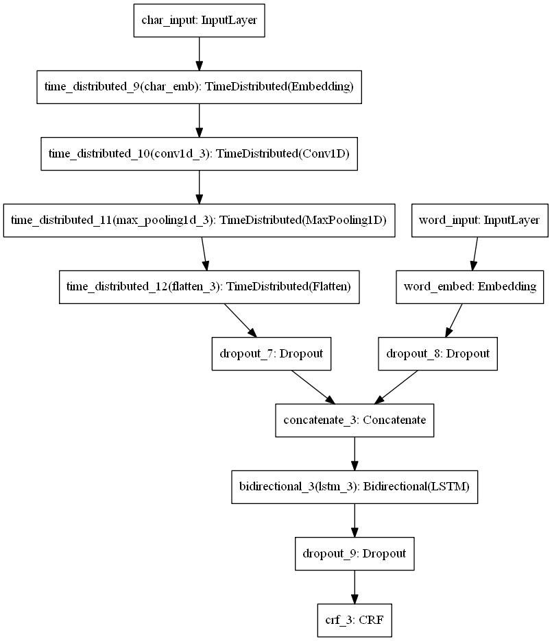

# **End-to-end**

##**Paper Title**
End-to-end Sequence Labeling via Bi-directional LSTM-CNNs-CRF

##**Full Citation**
Proceedings of the 54th Annual Meeting of the Association for Computational Linguistics (Volume 1:Long Papers), ACL 2016

##**Original Code**
https://github.com/gpandu/NER_DNN

##**Description**
1. The paper's task is to do Named Entity Recognition on Conll2003(But we will use benchmark in Conll2012 format)
2. The Neural Net model is: CNNs(char embedding + word embedding) + BLSTM + CRF(prediction and optimization)
3. This model is a true 'end-to-end', there is no feature engineering or data processing
4. Also, this model does not need c[hunk tags and POS taggings to fit in the model

##**Input and Output**
###**Input**
The input for training and testing are text sentences with the NER type, the data format will be in Conll2012 format, but we will
only use the first four columns in the experiment, which means the format is (current word, POS tag, chunk tags, NER tag), like 

    Big JJ (TOP(NP(NP* O
    Managers NNS *) O
    on IN (PP* O
    Campus NN (NP*)))) O
    In IN (TOP(S(PP* O

###**Outpur**
Testing or Predicting output are the words' NER type, they are saved as list of lists:

    [[..,..,..], [..,..], [..,..,..],...]

##**Evaluation**
Benchmark datasets:

    Conll2003, 
    Ontonotes(as time limited, the size was set 10%-20% of the original set), 
    CHEMDNER
    
Evaluation metrics and results:

|             |  Prediction    | Recall     |  F1-score |    
| ---------- | :-----------:  | :-----------: |:-----------: |
| Conll2003     | 0.84     | 0.84     |0.84     |
| Ontonotes     | 0.59     | 0.74     |0.65     |
| CHEMDNER      | 0.75     | 0.39     |0.50     |

##**Demo**
Link to the Jupyter Notebook:
[jupyter](extraction/named_entity/End_to_end/WholeProcess-Read_Train_Predict_Evaluate-CONLL2003-test.ipynb)

Link to the video on Youtube:

    https://youtu.be/fd5_nwWToio

##**Implementation Steps**
In order to implement the experiment, the following steps will be a 
good reference.
1. Please download embedding file of [Glove](https://nlp.stanford.edu/projects/glove/), 
which gives us the word embedding and character embedding vectors. 
According to the paper's instruction, we used the `glove.6B.100d.txt` embedding file. 
Then, the embedding file should be put under the `./data/` directory.
2. After setting the embedding file, then we need to set the training, validation and testing file. 
As an example, we will use `Conll 2003` benchmark datasets, you can download the three files [here](https://www.kaggle.com/alaakhaled/conll003-englishversion).
After downloading the three files, please put them under the `./data/` directory.
3. After setting all the required files, we need to do some setting in the `configs.py` file, 
there, you need to make sure the `GLOVE_EMBEDDINGS`, `TRAINING_FILE`, `VALIDATION_FILE`, `TEST_FILE` parameters all point correctly to the four files above.
4. After the configuration and preparation work, we are ready to run the codes.
There are two ways for you to do the experiment. 

    4.1. The first way is to follow steps in `WholeProcess-Read_Train_Predict_Evaluate-CONLL2003-test.ipynb`,
    the whole process of reading data, training the model, predicting the testing file and evaluating the result are all written in the cells.

    4.2. The second way is to open the `paper1Main_modified.py` file and run the `main()` functions inside, you will find
    there are one `main()` function and one `main2()` function, the first one goes through the whole process, the second one skip the reading and 
    training steps, this is when you have already trained the model and saved it, if you don't want to spend much time training again but just do 
    the predicting and evaluating step, you can use this function to save time.
     
##**Dependencies**
    python - 3.6.6
    keras(tensorflow backend) - 2.2.2
    tensorflow - 1.10.0
    keras_contrib - 2.0.8
    Numpy - 1.14.2
    seqeval - 0.0.5

