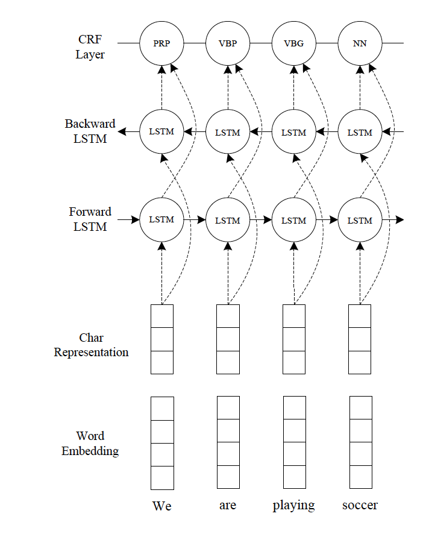

This repo is based on the following paper : 
# End-to-end Sequence Labeling via Bi-directional LSTM-CNNs-CRF
https://arxiv.org/abs/1603.01354

## original implementation for reference
https://github.com/IsaacChanghau/neural_sequence_labeling

### Architecture 

* The  experiment_final class implements NER  using CNN's B-LSTM's & CRF architecture  described in the paper
* convolutional neural networks (CNNs) are used to encode character-level information of a word into its character-level representation. 
* character- and word-level representations are combined  and fe them into bi-directional LSTM (BLSTM) to model context information of each word. 
* On top of BLSTM, a sequential CRF is used to jointly decode labels for the whole sentence
* CRF or softmax  used for prediction of label for each token 

	

### Input / output format 
For Training purpose it requires the following files:
train/test/dev dataset in input files. 
glove.6B.300d.txt
To run on full train data download files from this  link:
http://nlp.stanford.edu/data/glove.6B.zip

The training and test data is expected similar to standard CoNLL-type tab-separated format as indicated. One word per line, separate column for token and label, empty line between sentences.

Output format for predict : [start, span, token, type] -
start index: int, the index of the first character of the mention span. None in this case since its not applicable.
span: int, the length of the mention. None in this case since its not applicable.
mention text: str, the actual text that was identified as a named entity. Required.
mention type: str, the entity/mention type. None if not applicable.

### Instructions

* This project works best with python 3 and tensorflow 1.13.1
* After cloning the repository , install all the dependencies using pip install -r requirements.txt
* Download the word embeddings and place it inside the embeddings folder. glove.6B.300d.txt is the file required for the code
* The parse_config.py present in the utils folder has the model parameters and the necessary tensor flow flag initializations for any finetuning/ modifications that may be needed 

`python experiment_final.py` 

Note : Delete the checkpoint(ckpt) folder if training on a new dataset , to avoid overwriting the pre-saved model files

### Code flow 
Loads the config params necessary for the model , which is passed on during instantiation of NeuralSequenceLabeler class
`config = parseconfig.parseConfig()`

`neuralSequenceLabeler =  NeuralSequenceLabeler(config)`

read the dataset into the format required 
`dataset = neuralSequenceLabeler.read_dataset(file_dict,"benchmark_name")`

train the model 
`neuralSequenceLabeler.train(dataset["train_set"],dataset["dev_data"],dataset["dev_set"],dataset["test_set"])`

Obtain the predictions
`predictions_formatted = neuralSequenceLabeler.predict(dataset["test_set"],"test")`

Evaluation metrics
`neuralSequenceLabeler.evaluate(predictions, groundTruths,words_list, save_path,name)`

### Benchmark datasets 
CoNLL 2003 , Ontonotes 5.0 , CHEMDNER

### Evaluation metrics and results
The results obtained were run for limited epochs due to resource limitations. The trend indicates that these numbers would mirror the ones in the paper when run for 100 epochs 

Dataset |  Precision | Recall | F1
------------ | ------------- | ------------- | -------------
CoNLL 2003( 10 epochs ) | 83.76 | 82.74 | 83.25
Ontonotes ( 10 epochs) | 83.25 | 81.42| 80.35
CHEMDNER  | 74.01| 75.71| 74.85

### Demo : 

ipython notebook : 
https://github.com/data-integration-toolkit/ditk/blob/develop/extraction/named_entity/adiga_cnn_bstm_crf_ner/Paper2-cnn-bstm-crf_ner.ipynb
Youtube demo video : 
https://youtu.be/5P6eTECQ6X4

