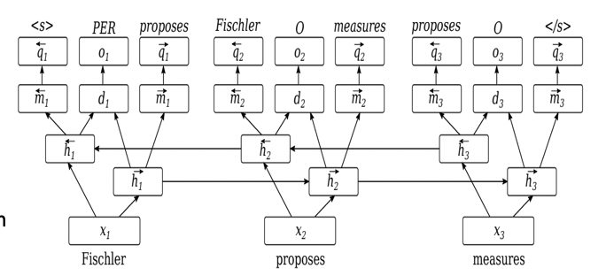

This repo is based on the following paper : 
# Semi-supervised Multitask Learning for Sequence Labeling by Merek Rei

## original implementation
https://github.com/marekrei/sequence-labeler

### Architecture 

* The  sequence_lableler_final class implements NER  using B-LSTM's & CRF architecture  described in the paper
* Language modeling ( next word prediction) is used as a secondary objective to improve the accuracy of the primary sequence labeling (NER) objective 
* Input tokens mapped to word embeddings – to obtain context specific representation for each word 
* biLSTM model built using tesnforflow uses the embeddings and has a combined cost function for LM and NER task
* CRF or softmax  used for prediction of label for each token 

	

### Input / output format 
For Training purpose it requires the following files:
train/test/dev dataset in input files. 
glove.6B.300d.txt
To run on full train data download files from this  link:
http://nlp.stanford.edu/data/glove.6B.zip

The training and test data is expected similar to standard CoNLL-type tab-separated format as indicated. One word per line, separate column for token and label, empty line between sentences.

Output format for predict : [start, span, token, type] -
start index: int, the index of the first character of the mention span. None in this case since its not applicable.
span: int, the length of the mention. None in this case since its not applicable.
mention text: str, the actual text that was identified as a named entity. Required.
mention type: str, the entity/mention type. None if not applicable.

### Instructions

* This project works best with python 3 and tensorflow 1.13.1
* After cloning the repository , install all the dependencies using pip install -r requirements.txt
* Download the word embeddings and place it inside the embeddings folder. glove.6B.300d.txt is the file required for the code
* The config file(fcepublic.conf) present in the conf folder has the model parameters and the necessary tensor flow flag initializations for any finetuning/ modifications that may be needed 

`python sequence_labeler_final.py` 

Note: Delete the 'model' folder  and the model_pickle.p file if training on a new dataset , to avoid overwriting the saved model files getting overwritten 

### Code flow 
Loads the config params necessary for the model , which is passed on during instantiation of NeuralSequenceLabeler class
`config = parseconfig.parseConfig()`

`labeler = Sequence_labeler(config)`

read the dataset into the format required 
`dataset = labeler.read_dataset(file_paths,"ConLL")`

train the model 
`labeler.train(data_train,data_dev,temp_model_path)`

Obtain the predictions
`predictions_formatted = labeler.predict(data_test)`

Evaluation metrics
`precision,recall,f1 = labeler.evaluate(predicted_labels,groundTruths, cost,"test")`

### Benchmark datasets 
CoNLL 2003 , Ontonotes 5.0 , CHEMDNER

### Evaluation metrics and results
The results obtained were run for limited epochs due to resource limitations. The trend indicates that these numbers would mirror the ones in the paper when run for 100 epochs 

Dataset |  Precision | Recall | F1
------------ | ------------- | ------------- | -------------
CoNLL 2003( 10 epochs ) | 81.64| 84.78| 83.18
Ontonotes ( 10 epochs) | 84.23 | 86.10| 85.20
CHEMDNER ( 2 epochs) | 65.45| 68.59| 66.98

###Demo : 

ipython notebook : 
https://github.com/data-integration-toolkit/ditk/blob/develop/extraction/named_entity/adiga_multitask_seq_labeling/Adiga_Multitask_sequence_labeling.ipynb
Youtube demo video : 
https://youtu.be/luzXD81CHZs

